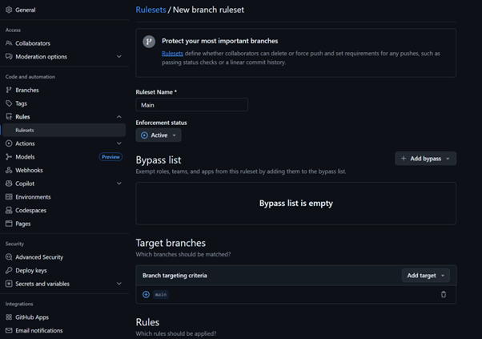
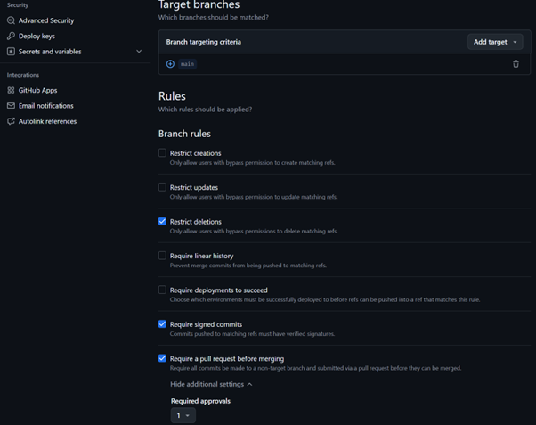
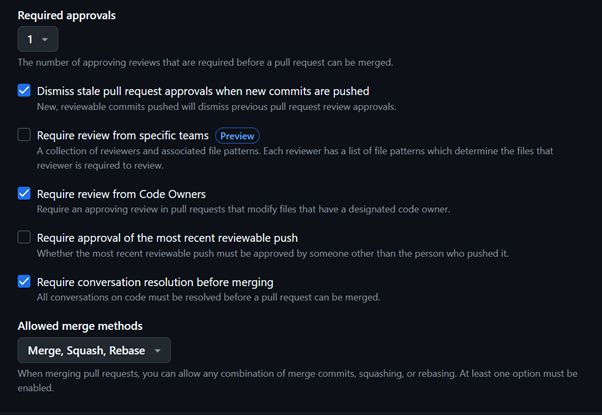
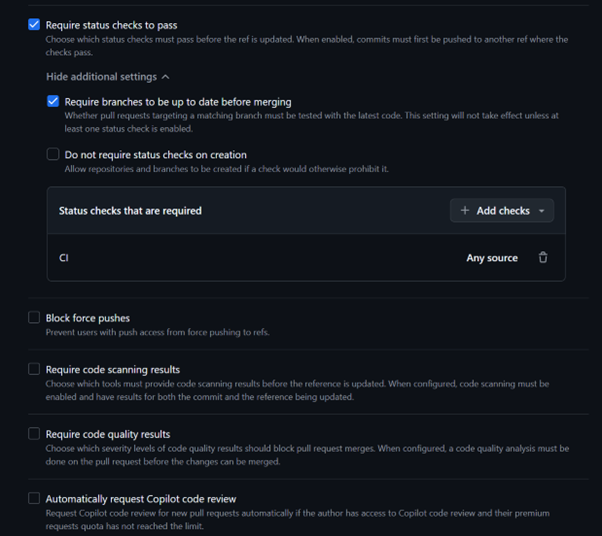
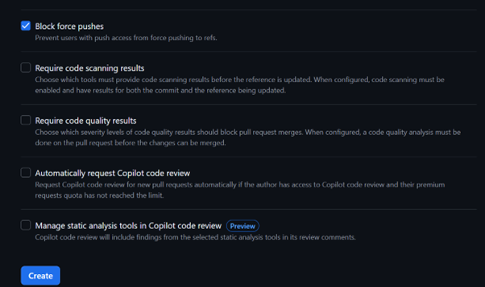

**Student/Group Name**: Juan Antonio Rodríguez Martínez
**Level Completed**: master-of-the-universe  
**Date**: 04/01/2026

---

## 📋 Exercise Summary

### Exercise: Branch Protection Rules and Security Best Practices (GPG Signing & Sensitive Data Management)
**Status**: ✅ Completed

**What I did**:
I completed the “Master of the Universe” exercise focusing on secure collaboration on GitHub. First, I validated that the `main` branch is protected by repository rules (PR-only changes, required status checks, and verified signatures). I attempted a direct push to `main` and confirmed GitHub rejected it with rule violations.  
Then, I followed the protected workflow by creating feature branches from `master-of-the-universe`, making **signed commits** using GPG, and pushing those branches to open Pull Requests.  
Finally, I implemented a sensitive-data prevention approach by adding a `.gitignore` with common secret patterns and scanning the repository history for risky strings and large blobs.


**Commands Used**:
```bash
# Update local main and attempt direct push (expected failure due to protections)
git checkout main
git pull origin main
echo "test" > direct-push.txt
git add direct-push.txt
git commit -m "Attempting direct push"
git push origin main

# Reset local main after failed push attempt
git reset --hard origin/main

# Protected workflow using feature branches
git checkout master-of-the-universe
git pull origin master-of-the-universe
git checkout -b feature/protected-workflow
echo "Proper workflow following branch protection" > workflow.txt
git add workflow.txt
git commit -S -m "feat: Add workflow documentation"
git push -u origin feature/protected-workflow

git checkout master-of-the-universe
git checkout -b feature/protected-workflow-2
echo "Proper workflow following branch protection (PR required)" > workflow-2.txt
git add workflow-2.txt
git commit -S -m "feat: Add workflow documentation (PR path)"
git push -u origin feature/protected-workflow-2

# GPG setup
gpg --list-secret-keys --keyid-format=long
gpg --full-generate-key
git config --global user.signingkey 1AB69EBDB72FD6C8
git config --global commit.gpgsign true
echo 'export GPG_TTY=$(tty)' >> ~/.bashrc
source ~/.bashrc
mkdir -p ~/.gnupg
echo "pinentry-mode loopback" >> ~/.gnupg/gpg.conf
echo "allow-loopback-pinentry" >> ~/.gnupg/gpg-agent.conf
gpgconf --kill gpg-agent
gpg --armor --export 1AB69EBDB72FD6C8

# Sensitive data management (Part 4)
git checkout master-of-the-universe
git checkout -b feature/sensitive-data-audit
cat .gitignore 2>/dev/null || echo ".gitignore no existe"
# (create .gitignore with secret patterns)
git add .gitignore
git commit -S -m "security: add .gitignore to prevent sensitive data leaks"

git log -p | grep -i "password\|api_key\|secret\|token" | head -20
git rev-list --objects --all | \
  git cat-file --batch-check='%(objecttype) %(objectname) %(objectsize) %(rest)' | \
  sed -n 's/^blob //p' | \
  sort --numeric-sort --key=2 | \
  tail -n 10

git push -u origin feature/sensitive-data-audit
```

**Results/Output**:
1. **Direct push blocked by repository rules (expected):**
```vbnet
remote: error: GH013: Repository rule violations found for refs/heads/main.
remote:
remote: - Changes must be made through a pull request.
remote:
remote: - Required status check "CI" is expected.
remote:
remote: - Commits must have verified signatures.
remote:   Found 1 violation:
remote:
remote:   c411e6e47628bc2e865241870f068956e4ff25bb
! [remote rejected] main -> main (push declined due to repository rule violations)
```

2. **GPG signing initial failure (before generating/importing key):**
```vbnet
gpg: skipped "Juan Antonio Rodríguez Martínez <jantoniorodma@correo.ugr.es>": 
No secret key
gpg: signing failed: No secret key
fatal: failed to write commit object

```

3. **GPG signing after setup (successfully created signed commit):**
```csharp
[feature/protected-workflow 764b872] feat: Add workflow documentation
 1 file changed, 1 insertion(+)
 create mode 100644 workflow.txt
```

4. **CI workflow present in main (required status check reference):**
```yaml
name: CI
on:
  pull_request:
    branches: [ "main" ]
  push:
    branches: [ "main" ]
jobs:
  build:
    runs-on: ubuntu-latest

```

5. **Sensitive-data scan examples (history grep + large blobs):**
```perl
git log -p | grep -i "password|api_key|secret|token" | head -20
# output included patterns like: secrets.*, api_key*, token*, secret* 
# (from .gitignore additions)

# Largest blobs included:
... 28879 tags.png
```

**Screenshots** (if applicable):
- Configuración de las reglas de protección de la rama `main`:







---

## 🎯 Key Learnings

**Main concepts I learned**:
1. Branch protection (repository rules) enforces professional workflows: no direct pushes, PR review gates, and required checks.
2. CODEOWNERS can block changes unless the owner approves, even if you can create branches and PRs.
3. GPG signing ensures commit authenticity (and GitHub can enforce “verified” signatures).
4. “Sensitive data management” is prevention + detection + remediation planning, not only `.gitignore`.
5. Git history scanning (grep in patches + blob size inspection) helps spot leaks or risky artifacts.

**Skills I improved**:
- Designing a safe PR-first workflow with protected branches.
- Creating and using GPG keys for signed commits.
- Troubleshooting GPG signing issues in Linux/WSL (pinentry/tty/agent).
- Auditing repository content for secret patterns and oversized blobs.

---

## 🚧 Challenges Faced

### Challenge 1: Required status checks couldn’t be selected in branch rules
**Problem**: In branch protection configuration, the “required status checks” option could not be completed because checks must exist and/or require code owner/admin permissions.

**Solution**: I validated the expected behavior by:
- Ensuring a workflow existed in `.github/workflows/ci.yml` on `main`

- Demonstrating that direct pushes are rejected with a message explicitly referencing the missing expected check and signature requirements.

- Proceeding with the exercise documenting the limitation and the observed enforcement behavior.

**Commands/Approach**:
```bash
git show origin/main:.github/workflows/ci.yml
git push origin main  # observe GH013 rule violation output
```

---

### Challenge 2: GPG “No secret key” error
**Problem**: `git commit -S` failed because there was no secret key configured locally.

**Solution**: 
- Generated a GPG key
- Configured git to use that signing key and enable signing by default
- Adjusted GPG agent / pinentry settings for terminal signing (loopback + GPG_TTY)
- Verified signed commits could be created and pushed

---

## 💭 Personal Reflection

**What surprised me**:
How strongly GitHub repository rules can enforce governance (PR-only, required checks, required signatures) and how CODEOWNERS creates a real organizational approval chain.

**What I found most difficult**:
The GPG setup details (agent, pinentry, passphrase prompts) and understanding why signing fails even when the key exists until the environment is configured properly.

**What I found most useful**:
Learning a realistic “enterprise workflow”: feature branches + PR + checks + verified signatures, and how to audit repos for potential leaks.

**How I would apply this in real projects**:
I would protect main/release branches, require PRs and CI checks, enforce signed commits for sensitive repos, and add automated secret scanning (pre-commit + CI). For incidents, I would rotate credentials immediately and then clean history using `git-filter-repo`/BFG only when necessary, coordinated with the team.

---

## 📊 Self-Assessment

Rate your confidence level for each topic (1-5, where 5 is very confident):

| Topic | Confidence (1-5) | Notes |
|-------|------------------|-------|
| Basic Git commands | 5 | Comfortable with everyday Git workflow |
| Branching & merging | 4 | Strong, plus PR-based workflow |
| Remote operations | 4 | Push/pull/branches/tags; protected branch behavior validated |
| Conflict resolution | 3 | From intermediate level; ok but can improve |
| History rewriting | 3 | From master level; understand risks |
| Git hooks | 1 | Not implemented here |
| Security practices | 4 | Branch rules + signing + auditing patterns |

---

## 🔗 Evidence/Artifacts

**Links to branches/commits**:
- Link to your outcome branch: `https://github.com/Horus106/taller-master-ugr/tree/group-A-outcomes/master-of-the-universe`

- Feature branch (protected workflow): `https://github.com/Horus106/taller-master-ugr/tree/feature/protected-workflow`


- Feature branch (PR path): `https://github.com/Horus106/taller-master-ugr/tree/feature/protected-workflow-2`

- Feature branch (sensitive audit): `https://github.com/Horus106/taller-master-ugr/tree/feature/sensitive-data-audit`


- Key commits demonstrating your work:
  - `764b872` feat: Add workflow documentation (signed commit)
  - `7aa2d65` feat: Add workflow documentation (signed commit)
  - `f1587f7` security: add .gitignore to prevent sensitive data leaks (signed commit)

**Additional files created** (if any):
- `workflow.txt`: Demonstration file for PR-first protected workflow.
- `workflow-2.txt`: Second demonstration file for PR-first workflow. 
- `.gitignore`: Prevention patterns for common secret files and key material.

---

## ✅ Completion Checklist

Before submitting, ensure you have:
- [x] Completed the exercise for your chosen level (including all parts)
- [x] Documented all commands used with their outputs
- [x] Described challenges and how you resolved them
- [x] Provided a thoughtful reflection on your learning
- [x] Self-assessed your confidence in each topic
- [ ] Pushed your outcome branch to the remote repository
- [ ] Created a Pull Request (if required by your instructor)

---

## 📝 Additional Comments

The only limitation I encountered was that I could not fully configure required status checks in branch rules due to repository permissions/code owner constraints. However, the repository rule enforcement clearly indicated “Required status check ‘CI’/‘build’ is expected”, and the CI workflow exists on `main`, so the concept and expected professional flow are demonstrated.


---

**Submission Date**: 04/01/2026  
**Ready for Review**: ✅ Yes / ❌ No
